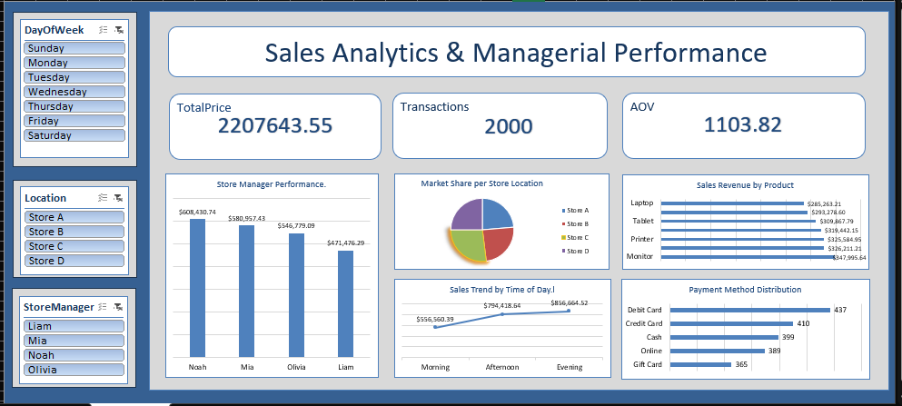

# Sales Analytics & Managerial Performance (Excel)

## Project Overview
This dashboard provides a comprehensive analysis of sales performance, store manager efficiency, and payment distribution.

## Key Insights
* **Total Sales:** $2.2M generated through 2,000 successful transactions.
* **Top Manager:** Noah achieved the highest sales performance, contributing $608,430.
* **Sales Trend:** Revenue peaks during the Evening ($856,664.52), showing a steady increase from Morning to Night.
* **Top Product:** Monitors lead the revenue chart with $347,995.64 in sales.
* **Payment Methods:** Debit cards are the preferred payment method with 437 uses.
* **Average Order Value (AOV):** Each transaction averages $1,103.82.

## Dashboard Preview

## Tools Used
* Excel (Pivot Tables, Power Query, Slicers).
